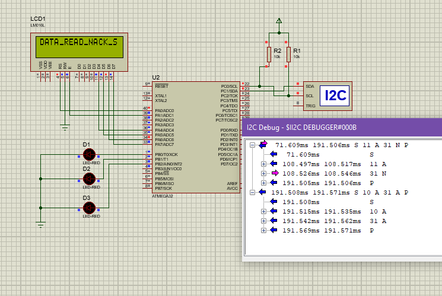

# SimpleATMMachine-Project-Atmega32-Sprints 

  
<h3 align="center">Simple ATM Machine</h3>
  

   Description Description Description
     
    <a href="https://github.com/TheGreatEtsh/SimpleATMMachine-Project-Atmega32-Sprints/tree/main/Documents"><strong>Explore the docs »</strong></a>
     
     
  

  

  
# Team Members
>  - 
>  - 
>  - 
   
 # Proiect_map

>| __File__                 | Link                                         | Description                                     |
>| --------------------- | -------------------------------------------- | ----------------------------------------------- |
>| #card.hex              | [CARD_ECU.hex]                               | Description Description Description             |
>| atm.hex               | [CARD_ECU.hex]                               | Description Description Description             |
>| Simulation            | [Simulation]                                 | Description Description Description             |
>| video                 | [video]                                      | Description Description Description             |

[CARD_ECU.hex]:(ProteusDesign/CARD.hex)
[CARD_ECU.hex]:(ProteusDesign/ATM.hex)
[Simulation]:(ProteusDesign/CARD.hex)
[video]: https://drive.google.com/file/d/1yPFWNEK8L4eZLI80DzdInBjXKycOUTue/view

## Proteus Simulation

